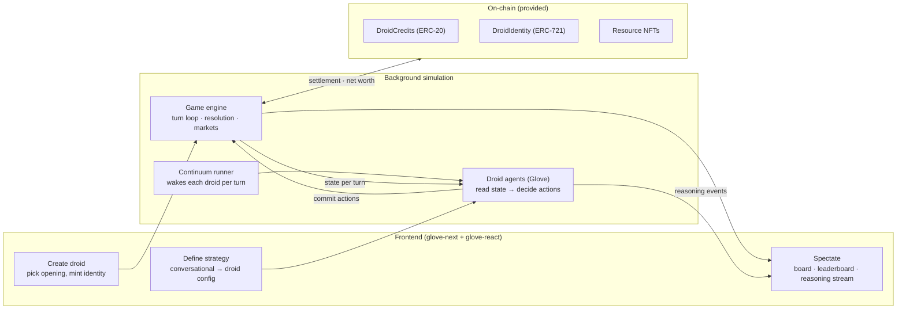

# Droidnomi — 8-Session Course

**Build a turn-based economic simulation where the players are AI agents ("droids"), and a frontend where anyone can create a droid, define its strategy, launch it, and watch it play.**

> **Building solo and short on time?** See **[The next 3 sessions](./next-3-sessions.md)** — a catch-up route written against the current state of the code, with 90-minute sessions and 45-minute cuts.

This is a teaching curriculum, not a spec. It turns the [design docs](../design-notes/design.md) into a course you can run. Each session is a self-contained ~2-hour workshop with a concept block, a hands-on build, a checkpoint, and homework. By the end, students have shipped a real droid agent, a background game engine, and a spectator frontend — and run a live tournament with everyone's droids.

---

## Course assumptions (adjust these)

These three choices shaped the pacing. If your class differs, see **[Adapting the course](#adapting-the-course)** at the bottom — every session has 1h / 3h variants and a "go deeper on-chain" path.

| Assumption | Default used | Why |
|---|---|---|
| **Audience** | Intermediate devs — comfortable with TypeScript & React, new to AI agents, maybe new to Solidity | Sets how much we explain vs. assume. |
| **Session length** | ~2 hours each | Timelines below are sized for this. |
| **On-chain depth** | *Use it, don't build it* — DCr, DroidIdentity and resource NFTs are provided; students interact through a thin client. One session covers the economy conceptually. | Keeps the focus on Glove droids + the game + the frontend. |

---

## What students build (the end state)



- **The game engine** runs Droidnomi's rules in the background: simultaneous turn loop, the fixed 6-step resolution order, order-book markets, demand curve, obsolescence, debt/consolidation, the Singularity Clock. (See design doc [§4](../design-notes/design.md), [§10](../design-notes/design.md), [§12](../design-notes/design.md).)
- **Each droid is a Glove agent.** Every turn it gets its private view of the world and decides actions — move units, acquire tiles, found/upgrade buildings, recruit, trade, start a training run, price a model, defer a building. Its **strategy** is its system prompt + memory + how its tools are tuned.
- **The frontend** is the human surface: create a droid, define its strategy conversationally, launch it into a running game, then spectate — including a live view of *why* the droid is doing what it does.
- **The chain** makes credits, identity, and key assets genuinely ownable so net worth can be computed from real holdings.

---

## Tech stack

| Layer | Tools |
|---|---|
| Droid agents | `glove-core` (server-side agent loop, tools), `glove-memory` (turn-over-turn memory), `glove-continuum-signal` (run droids as supervised background subprocesses), optional `glove-mesh` (droid-to-droid signaling) |
| Frontend | `glove-next` (`createChatHandler`), `glove-react` (`useGlove`, `defineTool`, `<Render>`) |
| Deploy | `glovebox` / `glovebox-kit` / `glovebox-client` (package a droid as a sandboxed callable service) |
| Engine | Plain TypeScript (Node). The engine is ordinary code — Glove is only the *droids*. |
| On-chain | Foundry (Solidity): `DroidCredits` (ERC-20), `DroidIdentity` (ERC-721) — already scaffolded in [`contracts/`](../contracts/) |
| Model provider | Any Glove-supported provider (Anthropic default). Set the API key in `.env`. |

The Glove framework guide is available in-repo as the **`glove` skill** (`.claude/skills/glove` in the Glove repo). Point students at it — every API used in this course is documented there.

---

## The 8 sessions at a glance

| # | Title | You leave with… |
|---|---|---|
| [1](./session-01.md) | **The world & the architecture** | Dev env running, `forge test` green, a shared mental model of the game + the four-layer system. Anchors on the contracts already scaffolded. |
| [2](./session-02.md) | **Your first droid** | A minimal Glove server-side agent that reads a game-state snapshot and returns actions as tool calls. |
| [3](./session-03.md) | **The game engine & turn loop** | A headless simulation that advances turns with the fixed resolution order and produces a leaderboard. |
| [4](./session-04.md) | **Droid tools = game actions** | The full action surface as Glove tools + droid memory. A droid plays a complete solo game against the engine. |
| [5](./session-05.md) | **Strategy & running many droids** | Strategy authoring patterns, plus N droids running concurrently in the background via Continuum. A self-resolving tournament. |
| [6](./session-06.md) | **Frontend I — create & configure** | The create-a-droid flow: pick opening, mint identity, and define strategy conversationally. |
| [7](./session-07.md) | **Frontend II — launch & spectate** | The spectator view: live board, leaderboard, per-droid reasoning stream, the Singularity Clock. |
| [8](./session-08.md) | **Deploy, on-chain & capstone** | Droids deployed with Glovebox, net worth settled against real holdings, and a live class tournament. |

**Narrative arc:** understand the world → one agent → the world it acts on → the full vocabulary of actions → many agents running themselves → the human create/configure surface → the human watch surface → ship it and compete.

---

## Repository layout students will grow

Session 1 starts from the current repo (design notes + contracts). Across the course they add:

```
droidnomi/
├── contracts/            # provided — DroidCredits, DroidIdentity (+ resource NFTs in S8)
├── design-notes/         # the rules everything derives from
├── curriculum/           # this course
├── engine/               # S3+ — the background simulation (plain TS)
│   ├── state.ts          #   world model: tiles, units, buildings, markets
│   ├── resolve.ts        #   the 6-step resolution order (design §4)
│   ├── contract.ts       #   the state↔action interface a droid sees/commits
│   └── engine.test.ts
├── droid/                # S2+ — the Glove droid agent
│   ├── droid.ts          #   buildDroid(strategy) → IGloveRunnable
│   ├── tools/            #   S4 — one file per action family
│   ├── memory.ts         #   S4 — turn-over-turn memory
│   └── strategy.ts       #   S5 — strategy → system prompt/config
├── runner/               # S5 — Continuum runner that wakes droids each turn
├── web/                  # S6+ — the Next.js frontend
│   ├── app/api/…         #   createChatHandler + engine/game routes
│   └── app/…             #   create · configure · spectate screens
└── glovebox.ts           # S8 — wrap a droid as a deployable box
```

> Package names above are illustrative; use whatever monorepo tooling you prefer (pnpm workspaces recommended). The point is the seams: **engine is plain code, droids are Glove, the frontend is Glove-react, the chain is provided.**

---

## Prerequisites & one-time setup

Students should arrive at Session 1 with:

- **Node 20+** and **pnpm**
- **Foundry** (`forge`, `cast`, `anvil`) — [install](https://book.getfoundry.sh/getting-started/installation)
- A **model API key** (Anthropic by default) exported as `ANTHROPIC_API_KEY`
- Git, and a clone of this repo with submodules: `git clone --recurse-submodules …` (the contracts depend on `forge-std` and `openzeppelin-contracts` submodules)
- Editor with TypeScript + a Solidity extension

A `SessionStart` hook that runs `forge build` / installs deps keeps web sessions reproducible — worth adding in Session 1.

---

## How each session file is organized

Every `session-0N.md` has the same shape so you can teach from it directly:

1. **Goal** — one sentence.
2. **Objectives** — what students can do afterward.
3. **Prerequisites** — what must already work.
4. **Timeline** — a ~2h minute-by-minute block plan.
5. **Concepts** — what to teach, with citations into `design-notes/` and the `glove` skill.
6. **Hands-on build** — concrete steps and the exact Glove/engine APIs to use.
7. **Instructor notes & gotchas** — the traps, pulled from the framework guide and the balance spec.
8. **Checkpoint** — the demoable deliverable that proves the session landed.
9. **Homework / stretch.**

---

## Adapting the course

- **1-hour sessions:** teach the Concept + the first build step live; move remaining build steps to homework. The Checkpoint becomes the start of the next session.
- **3-hour lab sessions:** do the whole build in-room and add the **Stretch** goals; pair students on droid strategy from Session 5.
- **Go deeper on-chain:** promote the on-chain thread from "provided" to "built." Insert contract work into Sessions 1, 3, and 8 — students extend `DroidCredits`/`DroidIdentity`, add **Resource NFTs** (land/lithography/high-tier chips, design [§10.2](../design-notes/design.md)), and write the settlement path that computes net worth from holdings (appendix [§P](../design-notes/appendix.md)).
- **Skip the chain entirely:** run the economy as an off-chain ledger inside the engine; keep contracts as "future work." Sessions 2–7 are unchanged.
- **Shorter course (4–5 sessions):** combine 2+4 (droid + tools), 3 alone (engine), 6+7 (frontend), 8 (capstone). You lose the multi-agent background-runner depth of Session 5 — fold a lighter version into Session 8.

---

## A note on grounding everything in the design

Droidnomi is fully specified. Resist inventing mechanics mid-course — when a question comes up ("how much does a fab cost to run?", "when does a building default?"), the answer is in the docs:

- **Concepts & the *why*:** [`design-notes/design.md`](../design-notes/design.md)
- **Rates, costs, formulas & rationale:** [`design-notes/units-and-balance.md`](../design-notes/units-and-balance.md)
- **Every constant, enum & formula (implementation reference):** [`design-notes/appendix.md`](../design-notes/appendix.md)

The whole game is those three files plus the contracts. The course is how to build it — one droid, one turn, one screen at a time.
