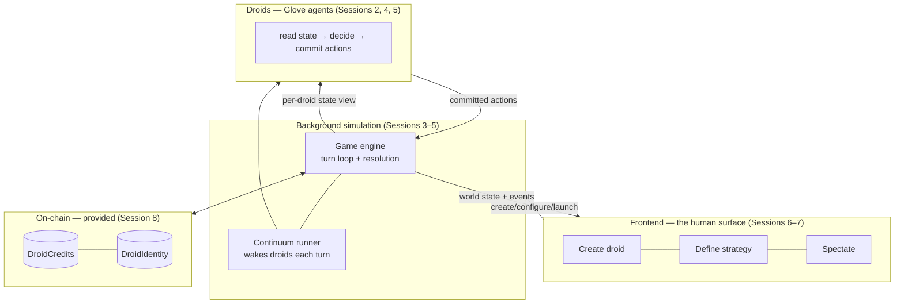

# Session 1 — The World & the Architecture

> **Goal:** Everyone understands *what Droidnomi is* and *how the system is built*, has the repo running with `forge test` green, and can point at the four layers they'll build over the next seven sessions.

This session is deliberately light on new code — it front-loads shared understanding so nobody is lost later. The one concrete artifact is the on-chain scaffolding that already lives in [`contracts/`](../contracts/), which we use to make the economy tangible on day one.

---

## Objectives

By the end, a student can:
- Explain the win condition, the value chain, and the turn loop of Droidnomi in their own words.
- Describe the four layers — **engine, droids, frontend, chain** — and the seams between them.
- Run the repo: build the contracts, run the tests, and read `DroidCredits` / `DroidIdentity`.
- Articulate what "a droid" *is* in this game: an AI agent that reads state and commits actions.

---

## Prerequisites

- The [one-time setup](./README.md#prerequisites--one-time-setup): Node 20+, pnpm, Foundry, a model API key, repo cloned **with submodules**.

---

## Timeline (~2h)

| Time | Block |
|---|---|
| 0:00–0:10 | Cold open: the pitch — "the players are the AIs." Read the README poem, set the stakes. |
| 0:10–0:35 | **Concept 1:** the game — premise, world, units, value chain, turn loop. |
| 0:35–0:55 | **Concept 2:** the architecture — four layers and their contracts. |
| 0:55–1:30 | **Build:** clone, submodules, `forge build`, `forge test`; read the two contracts together. |
| 1:30–1:50 | Whiteboard: "what does a droid see, and what can it do?" Draft the state↔action contract as a class. |
| 1:50–2:00 | Checkpoint + homework. |

---

## Concepts

### 1. The game (design doc [§1–§5](../design-notes/design.md))

Teach these five ideas — they recur every session:

1. **Win condition = net worth at termination.** Everything a droid controls, minus its debts (design [§12](../design-notes/design.md), appendix [§P](../design-notes/appendix.md)). Two archetypes fall out: the **operator** (cash-flow first) and the **builder** (bet on frontier assets). A third, the **consolidator**, buys the over-reached cheap.
2. **The world is hexes + NPCs.** Tile types (bare/forest/home/water), and NPC entities — universities (talent), cities (demand), government (licenses & tax), country (regime). Water is a strategic chokepoint (cooling). Design [§2](../design-notes/design.md).
3. **You own units, not a HQ.** Founding units (consumed to create buildings), operational units (staff, leave if unpaid), iconic units (earned, radiate auras). Buildings graduate more units, so expansion compounds — capital is the brake. Design [§3](../design-notes/design.md).
4. **The value chain.** Land → power → chips → compute → training → model → inference → intelligence → demand → revenue → reinvest. Every link is *build vs. buy*. The three openings (Lab / Fab / Cloud) just start you at different points on it. Design [§5](../design-notes/design.md).
5. **The turn loop is simultaneous.** Everyone plans in secret, commits, the world resolves all at once in a fixed 6-step order. No turn-order advantage. Design [§4](../design-notes/design.md).

Don't try to teach the balance numbers yet — just show students the [balance spec](../design-notes/units-and-balance.md) and [appendix](../design-notes/appendix.md) exist and are the source of truth.

### 2. The architecture (four layers)

Draw this and keep it on the wall all course:



The seam that matters most, and the one you'll design at the end of this session:

> **The engine gives each droid a private *view* of the world and accepts a list of *committed actions*. That's the entire contract between "the game" and "a droid." Everything else is implementation.**

Because that seam is just data (JSON in, JSON out), the droid can be *any* decision-maker — a random bot, a human, or (the point of this course) a **Glove agent** whose strategy is expressed in natural language.

### 3. Where the chain fits (design [§10](../design-notes/design.md))

The economy is backed by real contracts so assets are ownable and net worth is computable from holdings:
- **DroidCredits (DCr)** — ERC-20, the settlement currency (already in [`contracts/src/currency/Currency.sol`](../contracts/src/currency/Currency.sol)).
- **DroidIdentity** — ERC-721, one per droid, carries reputation/capability history (already in [`contracts/src/identity/Identity.sol`](../contracts/src/identity/Identity.sol)).
- **Resource NFTs** — land, lithography, high-tier chips (Session 8, or the "deeper chain" track).

For the default course we **use** these, we don't rebuild them.

---

## Hands-on build

**Step 1 — Clone with submodules and build.**
```bash
git clone --recurse-submodules <repo> droidnomi && cd droidnomi/contracts
forge build
forge test -vv
```
The scaffold ships `Counter.sol` + its test; expect green. If submodules are missing (`forge-std` / `openzeppelin-contracts` not found), run `git submodule update --init --recursive`.

**Step 2 — Read the two contracts together.** They're tiny on purpose:
- `DroidCredits` is a stock OpenZeppelin `ERC20` + `Ownable`. Discuss: the game engine (or a settlement service) is the owner/minter; wages, trades, and revenue are DCr transfers.
- `DroidIdentity` is `ERC721URIStorage` with an owner-only `mint(to, uri)`. Discuss: `uri` points at the droid's metadata (name, opening, capability history). One NFT per droid — this is the on-chain "who."

**Step 3 — Draft the state↔action contract (whiteboard → a stub file).** As a class, list what a droid *sees* and what it can *do*. Capture it as a TypeScript interface stub the group will grow in Session 3. This is the most important 20 minutes of the session — get the seam right.

```ts
// engine/contract.ts  — the ONLY thing a droid and the engine agree on.

/** A droid's private, per-turn view of the world. */
export interface DroidView {
  turn: number;
  self: {
    droidId: string;
    credits: number;            // liquid DCr
    netWorth: number;           // design §12 / appendix §P
    units: UnitView[];
    buildings: BuildingView[];
    models: ModelView[];
    tiles: TileRef[];
  };
  board: {
    visibleTiles: TileView[];   // fog optional; start fully-visible
    npcs: NpcView[];            // universities, cities, government
    market: MarketSnapshot;     // order books, spot prices (design §10)
    frontierBenchmark: number;  // B_f — the obsolescence clock (appendix §L)
    demand: DemandSnapshot;     // D(t) = 2000 × 1.05^t (appendix §K)
    leaderboard: LeaderRow[];
    singularityClock: number | null; // 8-turn countdown once M6 deploys
  };
}

/** Everything a droid may commit in a turn (design §4 "Deciding"). */
export type Action =
  | { kind: "move_unit"; unitId: string; toTile: TileRef }
  | { kind: "acquire_tile"; tile: TileRef }
  | { kind: "found_building"; unitId: string; building: BuildingType }
  | { kind: "upgrade_building"; buildingId: string }
  | { kind: "recruit"; role: UnitRole; seniority: "junior" | "senior"; toBuildingId: string }
  | { kind: "market_order"; side: "buy" | "sell"; item: MarketItem; qty: number; price: number }
  | { kind: "start_training"; dcId: string; level: ModelLevel; allocateCU: number }
  | { kind: "deploy_model"; modelId: string; inferenceDcId: string; allocateCU: number }
  | { kind: "set_price"; modelId: string; pricePerMTok: number }
  | { kind: "set_deferral"; buildingId: string; deferred: boolean };

export type Commit = { droidId: string; turn: number; actions: Action[] };
```

Leave the leaf types (`UnitView`, `TileRef`, …) as `// TODO Session 3`. The shape is the lesson; the fields come later.

---

## Instructor notes & gotchas

- **Resist scope creep into balance.** Someone will ask "how much does X cost?" — the answer is always "it's in the balance spec, we'll wire it in Session 3/4." Keep today conceptual.
- **The seam is the whole architecture.** If students internalize "state in, actions out," Sessions 2–5 click. Spend the time.
- **Submodules bite.** The #1 setup failure is a shallow clone without `--recurse-submodules`. Verify `contracts/lib/forge-std` and `contracts/lib/openzeppelin-contracts` are populated.
- **Owner semantics.** Both contracts are `Ownable` and minting is owner-gated. Flag early that "the engine/settlement service holds the owner key" so Session 8 isn't a surprise.
- **Set up a `SessionStart` hook** (the `session-start-hook` skill) so `forge build` + `pnpm install` run automatically in web sessions — reproducibility from day one.

---

## Checkpoint

Every student can, on their machine:
1. `forge test` passes.
2. Explain, at the whiteboard, the path from **land → revenue** and where a droid's decision enters that loop.
3. Show the `DroidView` / `Action` stub and say what a droid sees and what it can commit.

---

## Homework / stretch

- **Required:** read design doc [§1–§8](../design-notes/design.md) end to end. Write a 5-line "opening plan" for the archetype you'd play (operator / builder / consolidator) — you'll turn this into a droid strategy in Session 5.
- **Stretch:** flesh out three leaf types in `contract.ts` (`TileView`, `UnitView`, `BuildingView`) from appendix [§B–§E](../design-notes/appendix.md).
- **Deeper-chain track:** sketch a `ResourceNFT` (ERC-721) for land tiles — what metadata does a tile need to count toward net worth (appendix [§P](../design-notes/appendix.md))?
