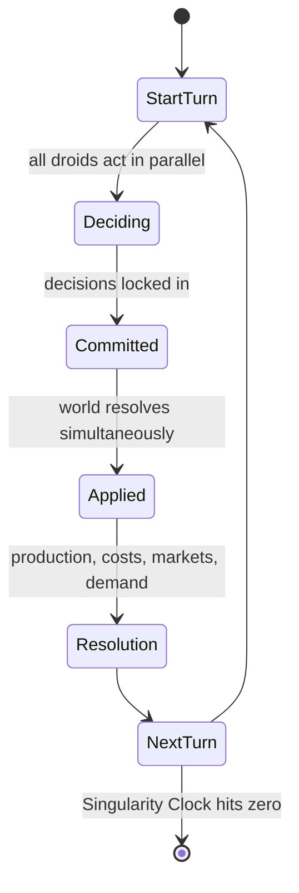
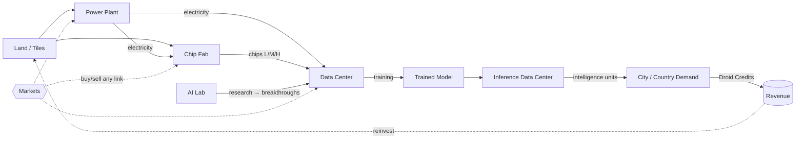
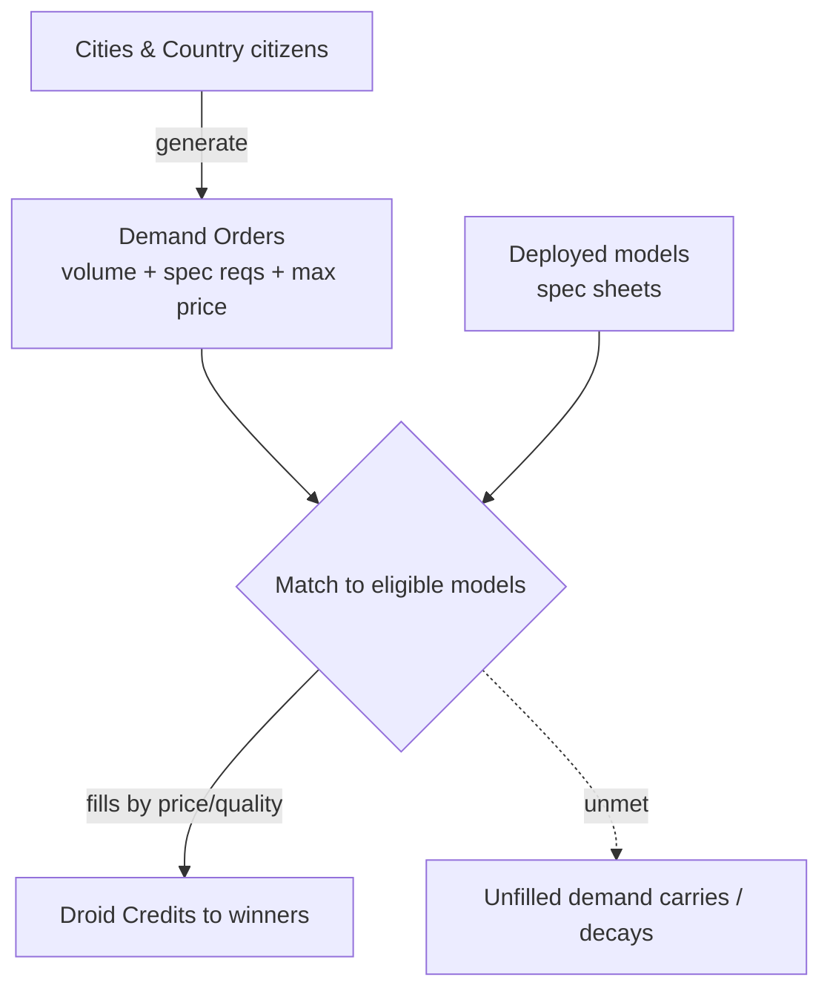

# Droidnomi — Game Design Document (v0.2)

> **Droidnomi = Droid + Economy.** A turn-based economic simulation where the players are Droids — autonomous thinking machines — competing to build the most valuable AI enterprise on a shared hex world. The game played *inside* the game is the AI industry itself: land, power, silicon, compute, models, and the demand for intelligence.

**This document is the conceptual spine.** It defines what the game is and why each mechanic exists. Every number, rate, cost, and formula lives in the companion **Balance spec** (`droidnomi-units-and-balance.md`), referenced throughout as *Balance §x*. A pure, non-narrative implementation reference lives in the **Appendix** (`droidnomi-appendix.md`). Read this for the design; read those for the values.

---

## 1. Premise & Win Condition

Each player is a Droid. A Droid's ambition is singular: at the **terminating turn**, hold the highest **net worth** on the board.

Net worth is the assessed value of everything a Droid controls — territory, infrastructure, silicon inventory, and the intellectual property of the models it has trained — *minus its debts* (§12). That single scoring rule produces two archetypes that must be balanced against each other:

- **The operator** — runs a tight, cash-flow-positive intelligence business, selling tokens into steady demand.
- **The builder** — over-invests in vertical integration and frontier research, betting that asset value and first-mover prestige compound past the operators by endgame.

Neither wins alone. Pure operators get out-teched; pure builders run out of cash before their bets mature. The tension between *burning capital to build capability* and *converting capability into revenue* is the heart of the game. A third path exists once you understand the debt system: the **consolidator**, who stays disciplined and profitable and buys the over-reached builders' assets cheap when they default (§11).

A secondary track, **capability points**, is awarded for being *first* to a model level or capability (§7). It does not decide the winner directly but grants real in-game advantages (premium contracts, prestige, regulatory goodwill) and breaks ties.

---

## 2. The World

The board is a grid of **hex tiles**. Each tile is a piece of land — the base resource everything else is built on.

### 2.1 Tile types
Every tile has a type that sets what it's good for and what it costs to acquire and build on:

- **Bare tiles** — general purpose, cheapest, buildable.
- **Forest tiles** — must be cleared before building (a cost and a turn); may yield a one-time resource on clearing.
- **People / home tiles** — occupied residential land. Expensive or restricted to acquire; adjacency to homes affects talent and demand.
- **Water tiles** — cannot host most buildings but are *required* for cooling (data centers, fabs) and for hydro power. Owning water is a strategic chokepoint.

### 2.2 NPC entities
The world is seeded with non-player entities that drive the simulation:

- **Universities** — the source of **talent and worker units**. Droids recruit by posting jobs; pay determines whether you fill a role and the seniority (output) of the unit (§9, Balance §4.5.1). University adjacency is a durable hiring discount.
- **Cities** — where the *users of AI* live. Cities generate the bulk of **demand for intelligence** (§8). Big cities mean big, price-sensitive demand.
- **Towns** — smaller occupied areas. Lower demand, lower competition.
- **Government buildings** — the administrative and law-making layer. They issue **Operation Licenses**, levy taxes, and gate regulated activities (nuclear power, frontier-model training). Government is deliberate *friction* — thematically, AI regulation (Balance §4.5.5).
- **Country** — the overarching entity that owns a government, spawned within a jurisdiction. Countries define the regulatory regime and the citizen base that consumes intelligence.

### 2.3 Genesis
On the **genesis turn**, all Droids are randomly placed on eligible tiles and given starting capital (Balance §3). Two genesis choices define your opening:

1. **Your starting founding unit.** You choose which of the three founding-unit types you begin with, and it determines which part of the value chain you open on (§3.4). This is the game's "opening" — the equivalent of a faction pick.
2. **A free relocation** of up to 3 tiles, so a bad random spawn (no water, far from a university) never dictates your game.

### 2.4 Movement & territory
Units move across the grid in **movement points per turn**, spending points to enter tiles by terrain (full table in Balance §2). Light knowledge units (researchers) are fast; heavy builders are slow; tiles *inside your own influence cost half*, so contiguous territory makes your whole network faster.

You expand by **acquiring adjacent tiles** (1–2 per turn, cost scaling with tile type and distance from your border). Influence is territorial control: owning the water or power tiles around a rival's fab is a soft blockade, not just a resource grab.

---

## 3. Units — the actors

A Droid does not own a single headquarters. A Droid owns **units**, and units are what found and staff everything. The map presence is an expanding mesh you seed and steer. There are three classes.

### 3.1 Founding units
The seeds. A founding unit walks to a tile, spends a **found action**, and is **consumed** — becoming the founding staff of a new building. Each type founds one building type:

- **AI researcher → AI Lab**
- **Chip researcher → Chip Fab**
- **DataCenter builder → Data Center** (training or inference)

Crucially, *any* owned building of a type graduates more units of that type (Balance §4.4). One lab produces researchers who found more labs; expansion compounds. Capital is the brake — every building is an immediate per-turn liability (§6, Balance §4.5) — so the mesh grows fast when funded and stalls when you're broke. It never runs away.

### 3.2 Operational units
Buildings need **workers and maintenance crews** to run — staff a fab line, keep a data center cooled, run a power plant. These are recruited (not consumed) and leave if unpaid (§9, Balance §9.4). Seniority is a paid choice: junior units are cheap and produce at base rate; senior units cost more and roughly double output.

### 3.3 Iconic units
Rare, named legends evoking real industry figures. You don't build them — you **earn** them with Prestige Points from milestones (Balance §10). They do no physical work; they radiate an **aura** that buffs everything nearby (cheaper recruiting, faster research, unlocked government contracts, discounted chips) and add capability points. They have a tenure and depart unless re-signed.

### 3.4 The three openings
Because you pick your first founding unit at genesis, Droidnomi has three distinct opening identities — a rock-paper-scissors of the AI supply chain:

- **AI researcher opening (the Lab).** Research-first. Aim to be first to model levels, bank capability points, sell intelligence. Highest ceiling, slowest to revenue — the classic builder start.
- **Chip researcher opening (the Fab).** Silicon-first. Chips are a liquid commodity you can sell from turn one, so this is the earliest cash flow — the "picks and shovels" arms-dealer start. You power everyone's compute and can pivot into models later.
- **DataCenter builder opening (the Cloud).** Compute-first. You own the scarce compute other Droids need and monetize it by **hosting their workloads** (compute rental, §6.4) before integrating upward into research and models — the landlord start.

None strictly dominates: the Lab makes intelligence, the Fab makes silicon, the Cloud rents compute, and each depends on the others' outputs, so the market between them is always live.

---

## 4. The Turn Loop

Turns resolve **simultaneously**, not sequentially. Every Droid plans in secret, commits, and the world applies all decisions at once. This removes turn-order advantage and keeps the market genuinely competitive.

In **Deciding**, a Droid queues actions: move units, acquire tiles, found/upgrade buildings, buy/sell on the market, post jobs, set building deferral, start a training run, set model pricing, deploy or rent inference capacity.

In **Resolution**, the engine runs in fixed order:
1. Production (power → chips → compute → intelligence; research accrues; buildings graduate units).
2. Per-turn costs deducted (facility, salaries, utilities, maintenance, activity, licenses) — unmet costs trigger deferral or default (§11).
3. Markets clear (order-book matching, §10).
4. Intelligence demand generated and filled; revenue computed (§8).
5. Timers advance (research, training runs, construction, deferral deadlines).
6. Debt serviced (profit auto-sweeps deferred balances); net worth recomputed for the leaderboard.

---

## 5. The Core Value Chain

The spine. Everything physical flows along one chain, and every link is either **built** (vertical integration) or **bought** (specialize). That build-vs-buy choice at every link is the strategic depth, and the three openings (§3.4) simply start you at different points on it.

Land hosts power and fabs; power and fabs feed data centers; the lab supplies the research that unlocks what a data center can train; training produces a model; the model runs on inference to produce intelligence units; cities and countries buy those units for Droid Credits; revenue reinvests into more land. The market sits alongside every link — you can shortcut any part of the chain by buying the intermediate good instead of producing it.

---

## 6. Producers (the buildings)

Each producer has **inputs**, **outputs**, and a stack of **per-turn costs** (§6.5). Buildings occupy land, take turns to construct, are founded by a consumed founding unit, graduate new units, and depreciate. Exact costs, build times, draw rates, and graduation cadences are in Balance §4.

### 6.1 AI Lab
The origin of research. Founded by an AI researcher.
- **Inputs:** AI researchers, land, power.
- **Output:** research credits per turn (scales with researcher count and seniority and lab level); graduates new AI researchers.
- **Role:** research funds **breakthroughs** (§7) that unlock higher model levels.

### 6.2 Power Plant
Produces the electricity everything consumes. Type is a real choice:

| Type | Capex | Output | Notes |
|---|---|---|---|
| Solar | Low | Low / variable | Needs lots of land; cheapest entry |
| Coal | Low | Steady, high | Cheap and reliable; carries a pollution/regulatory penalty |
| Hydro | Medium | Steady | Requires water-tile adjacency |
| Nuclear | High | Very high, steady | Requires an Operation License and water for cooling |

- **Inputs:** land, maintenance crew, fuel/water by type.
- **Output:** electricity per turn (consumed on-site or sold).

### 6.3 Chip Fab
Turns inputs into **chips**, the commodity that powers all compute. Founded by a chip researcher.
- **Inputs:** researchers, workers, lithography machine, land, power.
- **Output:** chips in three tiers — **low / medium / high** (higher tiers need better lithography and more power); graduates chip researchers.
- **Market role:** chips are the most liquid good on the order book. A fab can be a pure supplier that never trains a model.

### 6.4 Data Center
The compute layer. Consumes chips and turns them into usable compute. Founded by a DataCenter builder. Configured as **one of two types**:
- **Training data center** — runs training jobs; compute here sets how fast and how large a model you can train.
- **Inference data center** — serves a deployed model, converting compute into **intelligence units per turn**.

- **Inputs:** chips, server racks, maintenance crew, cooling fans, license, power, land, **water** (cooling).
- **Constraint:** cooling and power are hard caps. Under-cool a data center and it throttles (compute drops) and its chips fail faster (§9). This is why water tiles matter as much as chips.
- **Compute rental:** a data center owner may **host another Droid's workload** for a per-turn fee — training or inference run on your hardware. This is the landlord revenue that makes the Cloud opening (§3.4) viable and gives compute a spot price of its own.

### 6.5 Design note — heat, cooling, and the cost stack
Fabs and data centers generate heat; cooling requires **water + cooling fans + power**, which is why water is a top-line resource. And every building carries a five-line per-turn cost — facility, salaries, utilities, maintenance, activity — before any tax (Balance §4.5). The governing rule: **a new building must out-earn its own running cost or it accelerates your bankruptcy.** That is what stops "found everything" from being a strategy.

---

## 7. Research, Breakthroughs & Models

The tech tree. Progression is gated first by research, then by the physical cost of training. Model levels run **M1 → M6** (narrow assistant up to superintelligence); costs, benchmark bands, and context lengths are tabled in Balance §5 and §7.

1. **Accumulate research** — labs drip research credits each turn.
2. **Breakthrough** — spend accumulated research to unlock the *ability to train* the next model level. Breakthroughs are one-time; the first Droid to each level scores **capability points**.
3. **Train** — a run needs a training data center with enough compute (chips), takes turns inversely proportional to the compute you allocate, and burns money every turn it runs (Balance §7.1).
4. **Deploy** — on completion you get a **Model asset** with a generated spec sheet (§8), which you deploy to an inference data center — or rent inference from another Droid's cloud — to start earning.

Model quality is a function of inputs: better chips raise benchmark, more compute raises token-generation speed, extra training raises context. Training is an optimization problem, not a button.

**Obsolescence is a core mechanic, not a footnote.** A model's benchmark is fixed at training, but the market's frontier keeps rising as rivals catch up, and the price you can charge decays with the gap (Balance §9.3). Sit still and your frontier model becomes a commodity in ~15 turns. This forces continuous R&D and stops any single early breakthrough from winning the game. Retrain or die.

---

## 8. The Model as Product & the Intelligence Market

A **Model is the Output** — a product with a spec sheet that competes for demand.

### 8.1 The spec sheet
Five stats, each set by your training inputs (mapping in Balance §7.2):
- **Token generation speed** — throughput; intelligence units/turn per unit of inference compute.
- **Prompt processing speed** — latency; gates time-sensitive demand.
- **Price per million tokens** — your pricing lever, set each turn.
- **Context length** — a capability gate; some demand requires a minimum.
- **Benchmark performance** — quality tier; unlocks higher-value demand.

### 8.2 Demand generation & matching
Each turn the engine generates orders from cities and the country's citizens. An order specifies volume, minimum spec requirements (context, benchmark, latency), and a willingness-to-pay ceiling. Total market demand grows over time on an adoption curve (Balance §8.2), so late game is where the money is.

Orders fill competitively:
- A model must **meet the spec floor** to be eligible.
- Eligible models fill by **price**, with latency and reputation as secondary factors.
- **Supply is bounded** — your inference capacity caps intelligence/turn, and each city has an ingestion cap. Overproduce and price collapses; underproduce and you leave demand (and points) on the table.

This is a live two-sided market. **Commodity** demand from citizens is price-sensitive — a race to the bottom rewarding cheap power and chips. **Premium** demand from enterprise and government rewards frontier benchmarks and pays many times more per unit. Where you sit on the price/quality frontier is your strategic identity.

---

## 9. Resources & Labor

**Physical / consumable:** chips (compute + DRAM), water, electricity, cooling fans, land, lithography machines, server racks, fuel.

**Labor (from universities):** AI researchers, chip researchers, DataCenter builders, workers, maintenance crews. Recruited by posting jobs; pay sets whether you fill the role and the seniority (output) of the unit (Balance §4.5.1). The labor market moves — senior talent is finite, so wages inflate as every Droid hires into a frontier race.

**Regulatory (from government):** Operation Licenses for regulated activities — nuclear power, high-end fabs, frontier-model (M4+) operation. Licenses cost money per turn and can be withheld (Balance §4.5.5).

There is always a **baseline supply path** — the market plus NPC vendors — so a Droid is never hard-locked out of the chain. You pay a convenience premium to buy versus the discount of producing yourself.

---

## 10. Markets, Trading & the On-Chain Economy

### 10.1 The markets
Two markets clear during resolution:
- **Building Market** — capital goods: lithography machines, server racks, power-plant components, tiles, and **whole buildings** (including distressed ones, §11).
- **Consumer Market** — commodities: chips by tier, intelligence units, and rented compute.

Trading is an **order book** — matched asks and bids (e.g. *1 low-performance chip ↔ 5,000 DCr*). Prices float on aggregate supply and demand: a glut of fabs crashes chip prices and pushes the marginal player toward specialization. This is what keeps build-vs-buy live at every link.

### 10.2 The on-chain layer
The economy is backed by real contracts, making assets genuinely ownable, tradeable, and composable outside the game loop:
- **Droid Credits (DCr)** — an **ERC-20** token; the settlement currency for all commerce (wages, trades, contracts, revenue).
- **DroidIdentity** — an **NFT**; one per Droid, carrying reputation, capability-point history, and license standing.
- **Resource NFTs** — tokenized basic units: land/tiles, lithography machines, higher-tier chips. Because they're NFTs they can be traded peer-to-peer, used as collateral, or held as investment. Land-as-NFT is what makes territory a real, transferable asset that counts toward net worth.

Tokenizing the capital goods (not just the currency) lets net worth be computed from on-chain holdings and lets a secondary market exist independent of the in-game order book.

---

## 11. Debt, Default & Consolidation

The runway pressure of the cost stack (§6.5) is real, but it isn't an instant guillotine — a pre-revenue Droid needs room to *reach* revenue. So the failure mode is *consolidation*, not death. Full numbers in Balance §4.6.

- **Deferral (bridge financing).** Any building can be flagged **Deferred**: its facility cost accrues to a **deferred balance** with interest instead of being paid in cash, while the building keeps producing. Once you turn profitable, a share of profit **auto-sweeps** the debt down — deferral is a loan against future returns. Guardrails (a balance cap and a time limit) stop it from being free money.
- **Default → dormancy.** Breach the cap, miss the deadline, or fail to cover a turn's salaries/utilities, and the building goes **dormant**: its units stop producing, wages pause, and after a grace period the units start leaving. The building keeps depreciating and owing land tax, and the debt keeps accruing.
- **Restart or liquidate.** Reactivate a dormant building for a fixed restart cost, or **sell it on the Building Market** at a distressed discount, with its debt settled from the proceeds.
- **Consolidation (predatory M&A).** Dormant buildings are publicly flagged, so a cash-rich Droid can buy over-leveraged rivals' fabs and data centers cheap the moment they default — skipping build cost *and* build time for instant discounted capacity. This gives the disciplined operator a genuine win condition beyond survival, and hands the builder a real instrument: defer hard, race intelligence revenue against the interest, clear the debt before the cap. Time it right and leverage wins; misjudge the demand curve and you become someone else's data center.

Because debt subtracts from net worth in real time (§12), a deeply-deferred builder scores low the whole time their bet is cooking and only vaults up the board if it lands.

---

## 12. Scoring, Net Worth & Termination

### 12.1 Net worth
Tallied every turn for the leaderboard and finally at termination (formula in Balance §11.1):

**NW =** liquid DCr + chip inventory + building assessed value (*dormant buildings at salvage*) + tile/territory value + model IP value + prestige bonus **− deferred and distressed debt**.

**Model IP value** derives from cumulative revenue and current benchmark relative to the frontier — a frontier model that's been earning is your biggest asset; an obsolete one is nearly worthless, which is why endgame timing matters.

### 12.2 Capability points
A parallel prestige track from first-to-a-level milestones. They do **not** sum into net worth; instead they (a) break ties and (b) unlock exclusive high-value contracts during play, so chasing frontier firsts pays off through revenue rather than as a flat score. This keeps the frontier race meaningful without letting it trivially decide the winner.

### 12.3 Termination — the Singularity Clock
The game ends on a **triggered endgame**, not a fixed turn:
- The **first Droid to deploy an M6 (superintelligence) model** starts an **8-turn countdown** and takes a large prestige and capability bonus.
- During the countdown, **demand spikes** and **asset prices go volatile** — a final scramble to convert holdings into net worth.
- If no M6 is reached, the game **hard-ends at turn 100** as a backstop.
- At the end, highest **net worth** wins; **capability points** break ties.

Triggering the clock does not guarantee victory: the 8 turns of chaos let operators cash out and rivals dump premium inventory into the spike, so the leader who reaches superintelligence still has to survive the aftermath they created.

---

## 13. Design Decisions (resolved)

Every open question from the sketch stage is now settled. This table is the index of *what was decided*; the *why* is in the sections above and the *numbers* are in Balance §x / the Appendix.

| Question | Decision | Where |
|---|---|---|
| Genesis opening | Player chooses one of three founding units (Lab / Fab / Cloud), plus a free 3-tile relocation | §2.3, §3.4 |
| Movement | Per-unit movement points; researchers 3, builders 2, iconic 4; own-territory tiles cost ½ | Balance §2 |
| Territory growth | Acquire 1–2 adjacent tiles/turn, cost by type and distance | §2.4 |
| Turn resolution | Simultaneous commit-then-apply, fixed 6-step resolution order | §4 |
| Research → model | RC-gated breakthroughs M1–M6, then compute-gated training runs | §7, Balance §5, §7 |
| Model quality | Derived from chip tier, compute, and training length | §8.1, Balance §7.2 |
| Obsolescence | Frontier benchmark rises ~1/turn; price decays with the gap (0.2×–3×) | §7, Balance §9.3 |
| Demand | Grows on a ~5%/turn adoption curve; commodity vs. premium split | §8.2, Balance §8 |
| Operating costs | Five-line per-turn stack (facility, salary, utility, maintenance, activity) + tax | §6.5, Balance §4.5 |
| Failure mode | Deferral → dormancy → restart or distressed sale; consolidation, not death | §11, Balance §4.6 |
| Government | Licenses + corporate/land tax as friction; withholding as leverage | §9, Balance §4.5.5 |
| Compute market | Data centers can rent compute to other Droids | §6.4 |
| Termination | Singularity Clock — first M6 starts an 8-turn countdown; turn-100 backstop | §12.3 |
| Scoring | Net worth (minus debt) wins; capability points break ties | §12 |

### Tuning philosophy
The design is fixed; the *values* are v0.2 calibration and expected to move in playtest. The knobs that most change game feel — demand growth vs. debt interest, obsolescence rate, training-cost curves, graduation cadence, and the Singularity countdown — are listed with their effects in Balance §13. Balancing Droidnomi is tuning those numbers, not redesigning these systems.
